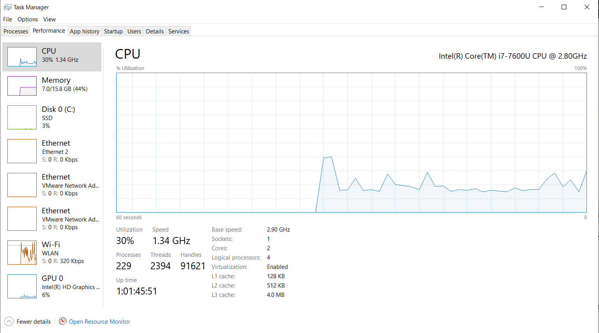
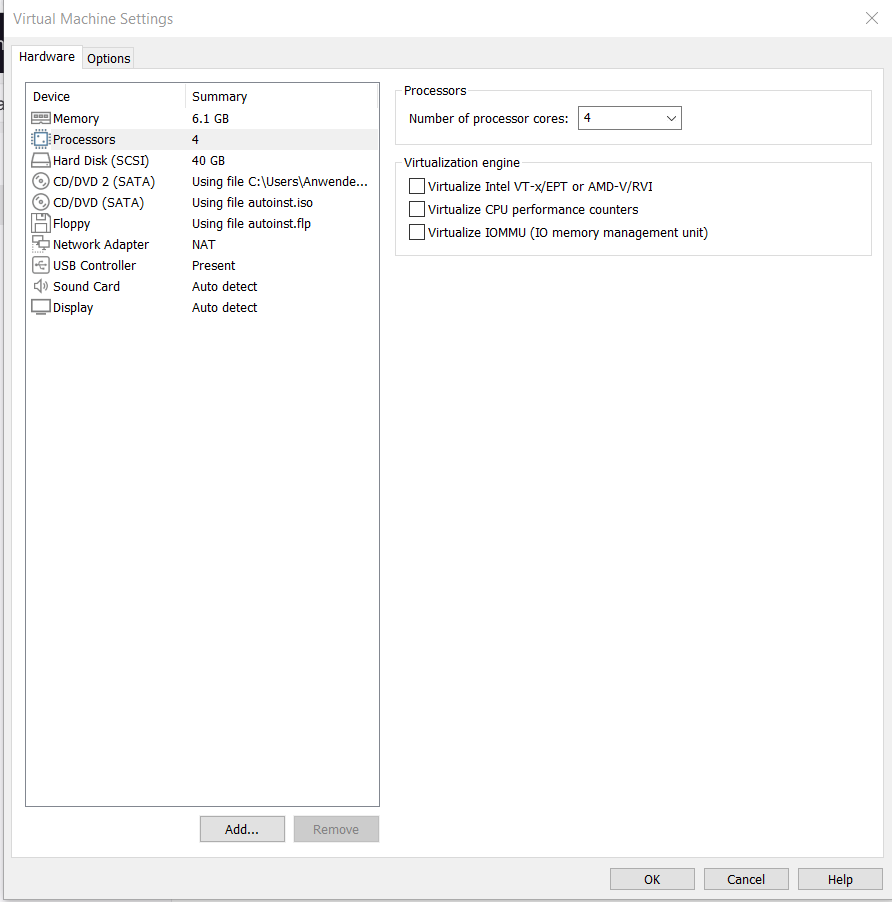
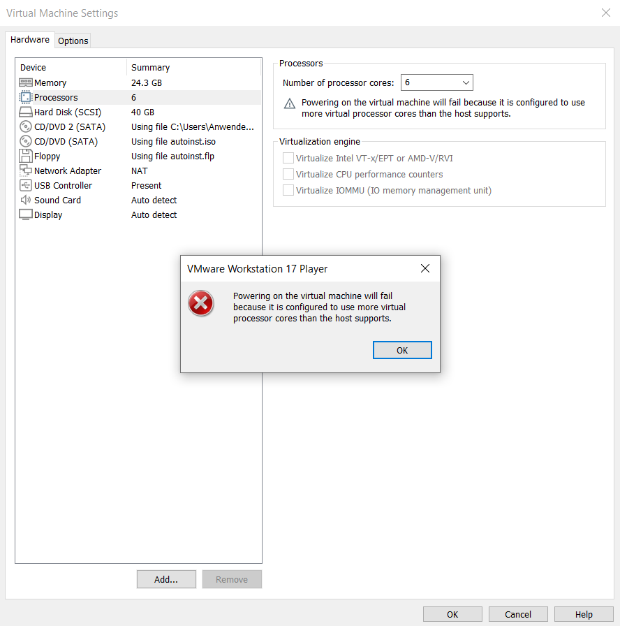
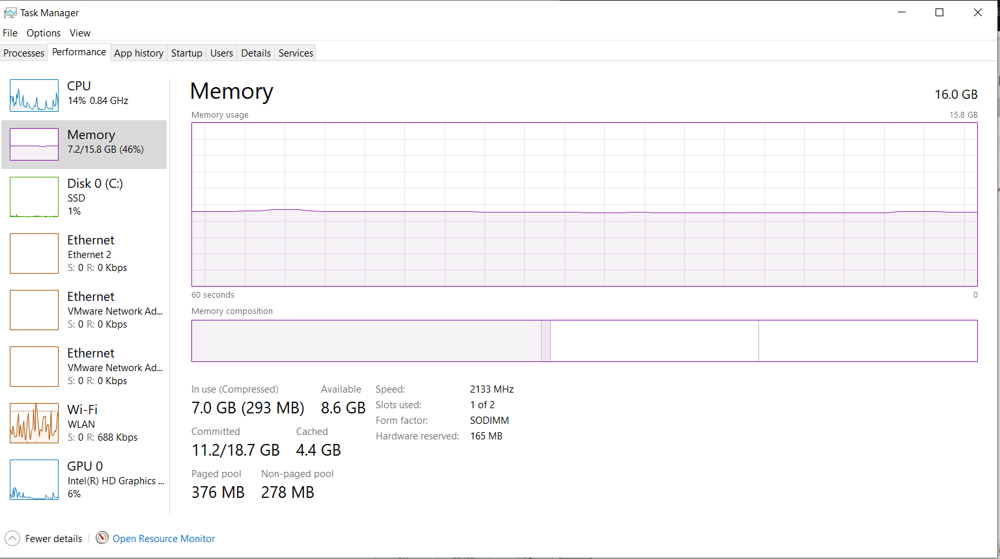
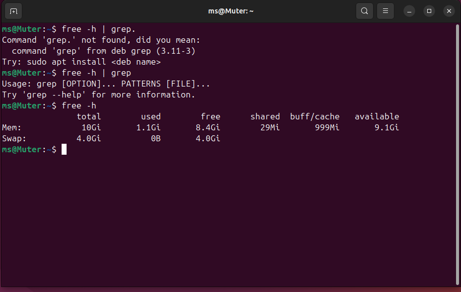
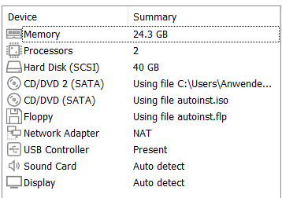
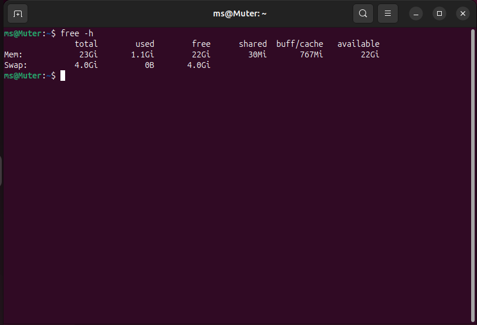

# Hypervisor typ 1 und 2

Hypervisor typ 1: Arbeitet direkt mit dem Hardware vom Computer
Hypervisor typ 2: Arbeitet als app und versucht ressourcen durchs OS Kernel zu bekommen
 
 

## Vermutung

Ich vermute mein PC hat Hypervisor typ 1, weil ich Hyper-V auf mein system habe, der ein typ 1 hypervisor ist. Aber weil ich auch VMWare heruntergeladen habe, habe ich den Hypervisor von VMWare, der ein typ 2 Hypervisor ist. Also ich habe beide Hypervisor typ 1 und 2.

 
 
 

# VM Ressourcen test

 

## Test 1 logische Prozessoren:

Probieren mehr logische Prozessoren als den PC hat hinzufugen.  

Wie man hier sehen kann, habe ich nur 4 logische Prozessoren:

Zuerst eine Kontrolle, zum sehen ob es uberhaupt geht:

Kontrolle:

Wenn ich probiere, mehr cores als ich habe einzugeben, gibt mir VMWare die folgende fehler meldung:

Und lasst mich gar nicht die Einstellung ändern.

### Breakdown von `lscpu | grep "CPU(s)"`

`lscpu | grep "CPU(s)"`

1. `lscpu`: gibt infos uber den Prozessoren
2. `|` : pipeline um diese infos in grep einzugeben
3. `grep "CPU(s)"`: sucht die zeilen wo sich den string "CPU(s)" findet und druckt dies aus

 
 

## Test 2 RAM:

Probieren mehr RAM als den PC hat hinzufugen.  

Wie man hier sehen kann, habe ich 16 GB RAM:

Zuerst eine Kontrolle, zum sehen ob es uberhauput geht:

Kontrolle:

Wenn ich probiere, mehr RAM als ich habe einzugeben, es funktioniert immer noch:

## Fazit

VMWare weisst, dass ich nur 4 logische Prozessoren habe, und deswegen erlaubt es nich uber dieser wert zu gehen, weil es diese Cores reservieren muss und es gibt nur 4, die man reservieren kann.  
Mit RAM ist es aber ein bisschen anders. Weil RAM sehr einfach dynamisch zugeordnet sein kann, der Hypervisor nutzt nur so viel RAM wie es wircklich braucht. Der RAM wert im VM-Einstellungen setzt nur ein limit auf den RAM das es nutzen darf, aber es reserviert nicht alles und nutzt es dynamisch, abhängig von wie viel es braucht.