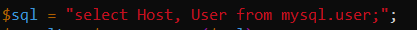

# KN 03

## Befehle

`sudo` - root auth  
`apt` - Linux installer  
`systemctl restart <service>` - restarts the specified service

`sudo apt update` - Updates apt  
`sudo apt install apache2` - Installs apache2  
`sudo apt install php` - Installs php  
`sudo apt install libapache2-mod-php` - PHP Extension for apache  
`sudo apt install mariadb-server` - Installs Database Server  
`sudo apt install php-mysqli` - Installs PHP package for SQL requests  
`sudo mysql -sfu root -e "GRANT ALL ON *.* TO 'admin'@'%' IDENTIFIED BY 'Your-Password' WITH GRANT OPTION;"` - Creates new Admin user with password set to 'Your-Password'  
`sudo systemctl restart mariadb.service` - Restart mariadb server  
`sudo systemctl restart apache2` - Restart apache webserver  
`cd ~` - CD to home directory  
`git clone https://gitlab.com/ch-tbz-it/Stud/m346/m346scripts.git` - Clones the git repo  

## A)

### Webseite:  
Index:
  
Info:  
  
Db:  
  

Problem war in file `db.php`:  

Man muss hier die Fragezeichen mit den gesetzten passwort ersetzen. 

### AWS Instanz

Ip:
  

Regeln:  
  

### MySQL

Gewunschte query in db.php gesucht:  
  

Mit MySQL verbinden:  
  

SQL query ausfuhren:  
  

