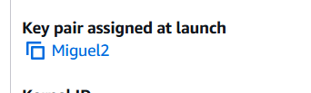
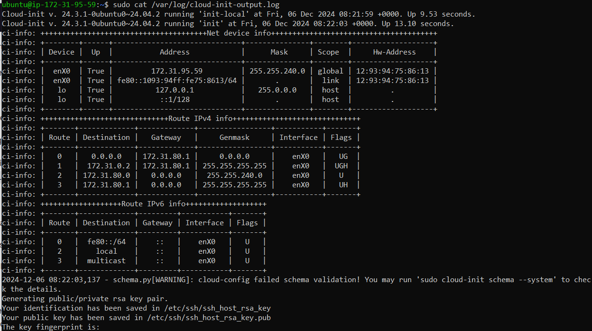
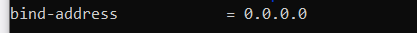
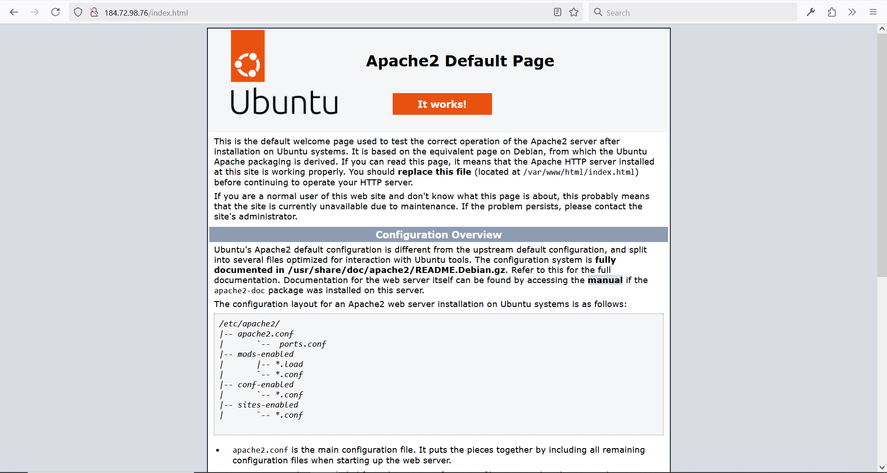
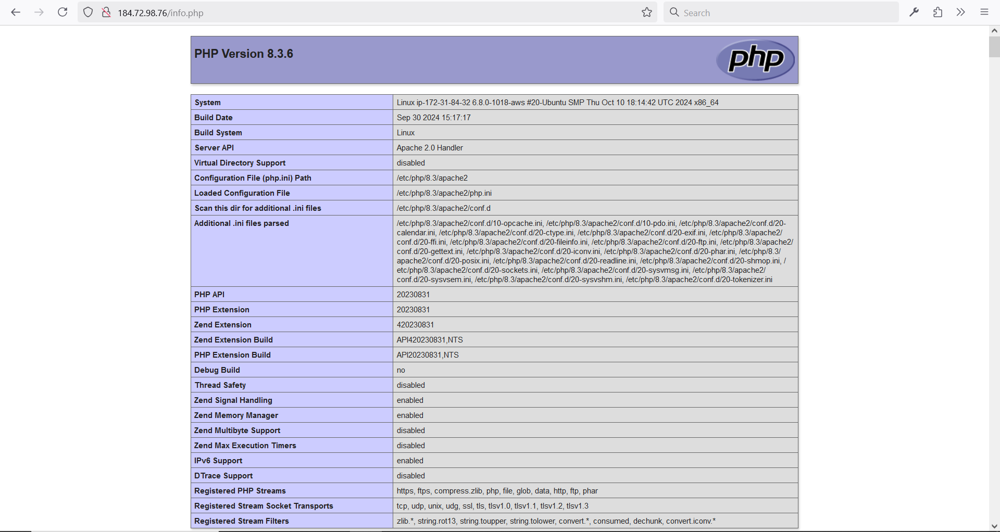
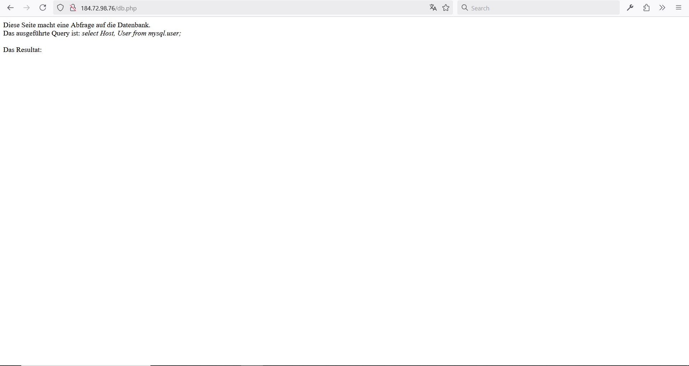
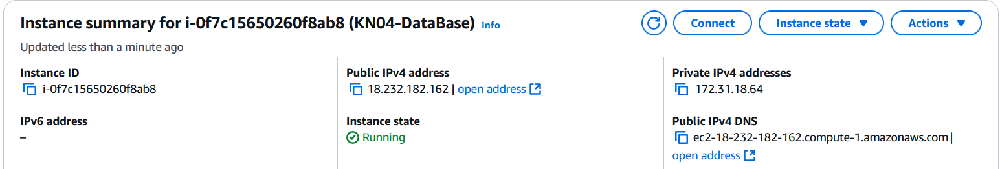
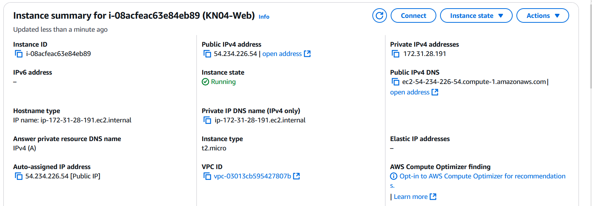
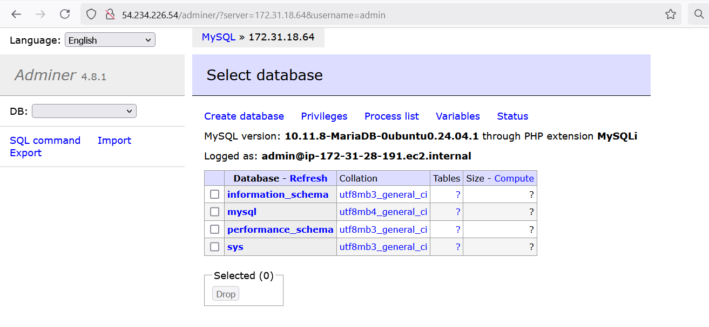

# KN04

## A) Cloud-init Datei

Eine Cloud-init Datei wird benutzt um schnell und immer wieder gleich eine Cloud-instanz zu inizialisieren. Dafur muss mann nichts mit dem UI machen und man kann, wenn mann ein gutes config hat, dies uberall kopieren.

`users:  ` Hier werden die nutzer auf der VM Definiert 

`name: ` Name der nutzer demfalls Ubuntu  
`sudo: ` Wer Admin-rechte hat, und was fur ein passwort es braucht  
`groups: ` Die nutzer-gruppen auf der VM  
`home: `Home verzeichniss der nutzer  
`shell: ` Wo der shell sich findet (z.b. bash, powershell etc.)  
`ssh_authorized_keys: ` Welche keys man nutzen kann, um der VM zuzugreifen  
`ssh_pwauth: ` Sagt ob man darf mit passwort beim VM einloggen, oder nur mit shh key  
`disable_root: ` Ob der "root" Konto aktiviert ist, also ob man sich mit root einloggen kann  
`package_update: ` Ob die packages automatisch updated sein sollen  
`packages: ` Welche packages der VM am anfang herunterladen soll  

Mann kann dann mehrere nutzer und ssh_authorized_keys einfugen, indem mann einfach  
`- name: andere_nutzer`  
`Wieder die gleiche user felder eingeben`

und fur die ssh_authorized_keys und andere felder  
`- your_ssh_key`

## B) SSH-Key und Cloud-init

Benutzte Cloud-init:  
[Cloud Init](./cloud-init.yaml)

Key-Pair assignment at launch:  

Erste Schlüssel:  

Zweite Schlüssel:  

Cloud init log:  

## D)

Instance Config:

Wert der ersetzt wurde:  

Angerufene endpoints:

Ich weiss nicht warum es nichts anzeigt aber... (ja, passwort wurde geandert)

### Zweite versuch, (erste war falsch)

Instanzen:  
DB:  

Webserver:  

Adminer:

Hier habe ich die private IPv4 addresse benutzt und dies, wie erwartet, funktioniert

db.php:

Man muss beim DB port 3306 freischalten, dann kann man einfach mit adminer verbinden