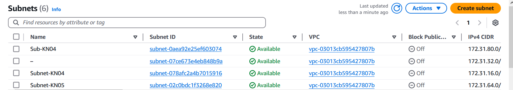

# KN05

## A)
Subnet: Lokales netzwerk mit lokalen ip's

VPC: creates a subnet

ich habe 6 subnets, alle von einer default VPC abgedeckt

Offentliche ip: ip der der ganze internet zugreifen kann
Private ip: ip in eigenen subnetz normalerweise `192.x.x.x`

ip's werden normalerweise dynamisch vom dhcp verteilt, eine statische ip ist eine empfehlung diese ip adresse geteilt zu werden vom dhcp

Subnetz-Liste  

IP-Addressen:
- web: `172.31.64.10`
- db:  `172.31.64.20`

## B)

Elastische ips: 

Gestoppte instanzen:  

Subnetz info:  

### Ab diesen Zeitpunkt ist die IP adresse von Webserver 172.31.64.30, weil es einen problem gab, und ich musste die instanz wieder neu erstellen, aber sonst ist alles gleich

Webserver seiten:  

