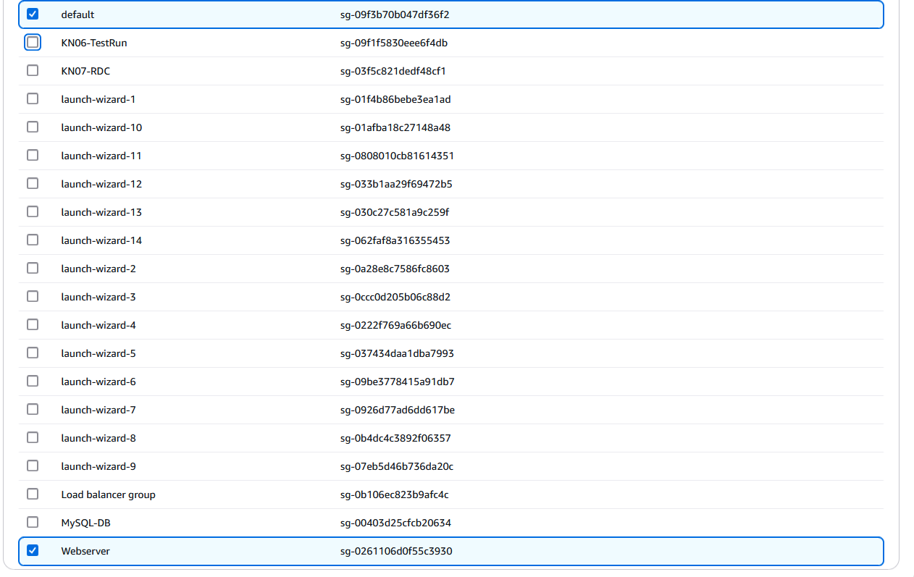
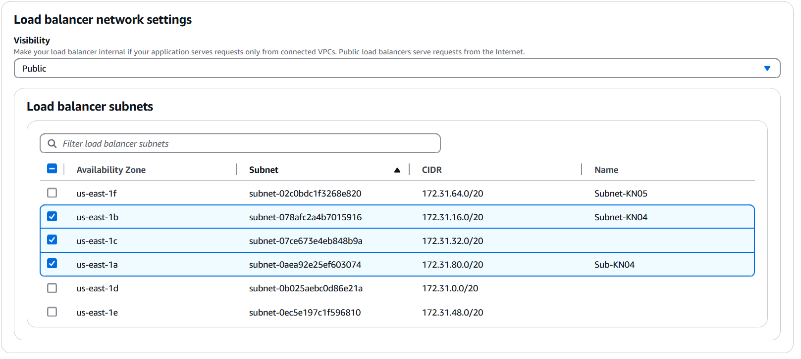
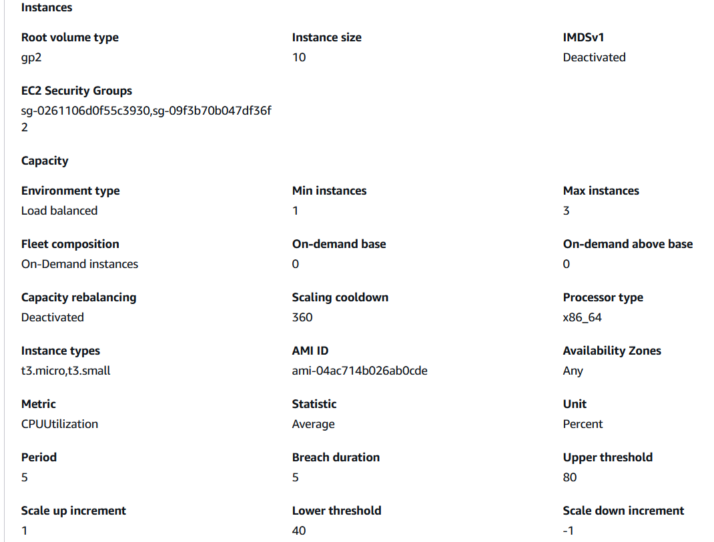

# KN07 PAAS

## A) Datenbank im PAAS Modell

Ausgefuhrte query  
 

1. SaaS und PaaS sind einfacher und schneller vorzubereiten
2. Man braucht nicht unbedinkt all zu viele kontrolle uber die datenbank
3. Mind. auf testing, man muss zusatzliche schritte machen, damit man, mit die datenbank durch VM's, sich verbinden kann.

## B) PAAS Applikation erstellen

Plattform, Java (warum nicht):  
  

Subnet und Security-group gewahlt:  
  
  

Kein DB gewahlt, zur zeit, nur front-end app:  
  

Auto-scaler einstellungen:  
CPUUtilization gewahlt, weil dies haufig benutzt wird, und oftmals POF ist.   
Prozent fur upper/lower threshold weil es damit einfacher zu arbeiten ist  
  

Load-balancer einstellungen:  
Basische Load-balancer einstellungen gewahlt  
  
Man braucht mindestens 2 subnetze, in meiner fall nutze ich nur eins, aber ich muss trotzdem mind. 2 auswahlen  
  
Neue load balancer, dann kann ich es mit mein eigenen erstellten vergleichen.  
Sonst alles auf default lassen, (fur prod von 80 auf 443 andern)  
  

Normalerweise wurde ich auch, wie folgt, ein log hinzufugen, aber leider genugen die rechte die ich habe nicht, um dies zu tun.  
  

Fur deployment habe ich rolling gewahlt. Dies wird oftermals benutzt, weil dann mussen die nutzer nicht warten bis der update fertig ist.  
  

Weil diese applikation nicht oft und nicht regelmassig updated wird, habe ich diese option ausgestellt  
  

Bei monitoring habe ich, was ich die wichtigsten kriterien fand, gewahlt  
4xx zum sehen ob es vielleicht einen hacker/ddos angriff gibt  
5xx um server errors zu finden  
Latency, LoadAverage und ApplicationRequestsTotal zum sehen ob wir weiter scalieren sollen  
InstancesDegraded/Severe, falls es andere probleme gibt  

So sieht alles aus:  

## C) CloudFormation

CloudFormation ist mehr fur high-level sachen, und umfasst mehrere ressourcen.  
Cloud-init ist eher fur einzelne instanzen und mehr low-level.  

Erstellt wird:  

- Load Balancer  
- "name"-env EC2 instanz  
- Load Balancer erstellte instanzen  
- CloudFormation Config  
- 